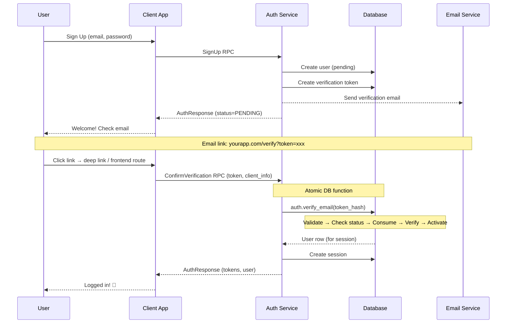
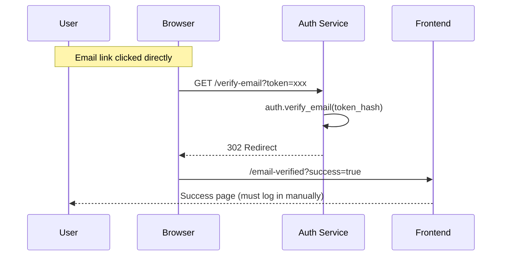
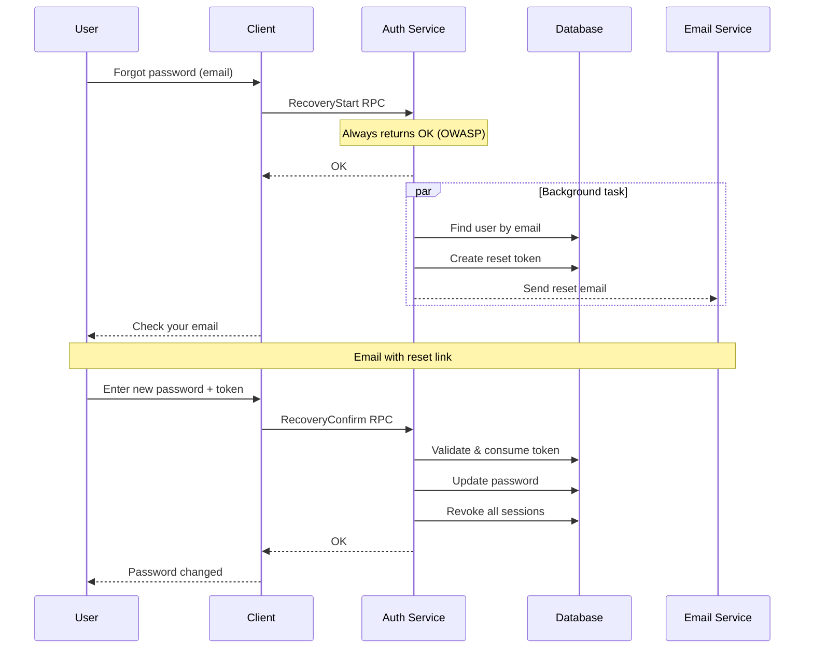
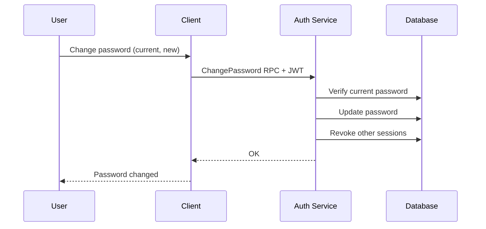

# Auth Service

High-performance authentication gRPC service built with Rust 1.93, Tonic, and SQLx.

## Architecture

```
┌───────────────────────────────────────────────────────────────────┐
│                    gRPC / gRPC-Web / REST                         │
├───────────────────────────────────────────────────────────────────┤
│  Middleware: Auth (JWT) │ Request ID │ Client IP │ Rate Limit     │
├───────────────────────────────────────────────────────────────────┤
│                       AuthService (Tonic)                         │
├───────┬──────────┬──────────┬─────────┬────────────┬──────────────┤
│auth-db│auth-proto│auth-email│auth-core│auth-storage│auth-telemetry│
│(SQLx) │ (Tonic)  │  (SMTP)  │(Shared) │    (S3)    │              │
├───────┴──────────┴──────────┴─────────┴────────────┴──────────────┤
│                  PostgreSQL │ S3-compatible                       │
└───────────────────────────────────────────────────────────────────┘
```

### Workspace Crates

| Crate            | Purpose                                                                |
| ---------------- | ---------------------------------------------------------------------- |
| `auth-core`      | Shared types, errors (`AppError`), traits (`StatusExt`, `ValidateExt`) |
| `auth-db`        | SQLx queries with compile-time verification                            |
| `auth-proto`     | Generated protobuf code from Tonic                                     |
| `auth-email`     | SMTP email delivery                                                    |
| `auth-mailjet`   | Mailjet API integration                                                |
| `auth-storage`   | S3-compatible object storage                                           |
| `auth-telemetry` | Tracing, metrics, OpenTelemetry                                        |

## Features

- **OWASP-compliant** authentication with account lockout and generic error messages
- **Session management** with device tracking and geolocation
- **JWT tokens** with configurable TTL (access + refresh)
- **Refresh token rotation** — tokens are single-use (replaced on each refresh)
- **Password recovery** with secure token-based reset flow
- **Email verification** with auto-login support
- **Streaming RPCs** for efficient bulk data transfer
- **gRPC-Web** support for browser clients
- **OpenTelemetry** tracing and Sentry error tracking

### Planned Features

- **Multi-factor authentication** (TOTP, SMS, Email, Recovery codes)
- **OAuth 2.0** with PKCE (Google, GitHub, Microsoft, Apple, Facebook)

## Quick Start

```bash
# 1. Configure environment
cp configs/.env.example configs/development.env

# 2. Run database migrations
make db

# 3. Start the service
make run
```

## Environment Variables

### Required

| Variable         | Description                                |
| ---------------- | ------------------------------------------ |
| `DB_URL`         | PostgreSQL URL: `postgres://user:@host/db` |
| `JWT_SECRET_KEY` | JWT signing key (min 32 chars)             |

### Server

| Variable              | Default         | Description                               |
| --------------------- | --------------- | ----------------------------------------- |
| `PORT`                | —               | Overrides `GRPC_ADDRESS` (Cloud Run, etc) |
| `REST_ADDRESS`        | —               | Not used, for future port separation      |
| `GRPC_ADDRESS`        | `0.0.0.0:50051` | Server bind address                       |
| `GRPC_WEB`            | `true`          | Enable gRPC-Web (HTTP/1.1)                |
| `GRPC_API_REFLECTION` | `false`         | Enable gRPC reflection                    |
| `CORS_ALLOW_ORIGINS`  | —               | Allowed origins (comma-separated or `*`)  |
| `CONCURRENCY_LIMIT`   | `100`           | Max concurrent requests                   |

### Authentication

| Variable                       | Default | Description                         |
| ------------------------------ | ------- | ----------------------------------- |
| `ACCESS_TOKEN_TTL_MINUTES`     | `60`    | Access token lifetime               |
| `REFRESH_TOKEN_TTL_DAYS`       | `90`    | Refresh token lifetime              |
| `PASSWORD_RESET_TTL_MINUTES`   | `60`    | Password reset link expiry          |
| `EMAIL_VERIFICATION_TTL_HOURS` | `24`    | Email verification expiry           |
| `MAX_FAILED_LOGIN_ATTEMPTS`    | `5`     | Failed attempts before account lock |
| `LOCKOUT_DURATION_MINUTES`     | `15`    | Account lockout duration            |

### Database

| Variable             | Default | Description                       |
| -------------------- | ------- | --------------------------------- |
| `DB_PASSWORD`        | —       | Password (inserted into `DB_URL`) |
| `DB_POOL_MIN`        | `2`     | Min pool connections              |
| `DB_POOL_MAX`        | `10`    | Max pool connections              |
| `DB_CONNECT_TIMEOUT` | `30`    | Connection timeout (seconds)      |

### Storage (S3)

| Variable               | Default | Description                      |
| ---------------------- | ------- | -------------------------------- |
| `S3_URL`               | —       | S3 endpoint URL with bucket      |
| `S3_ACCESS_KEY_ID`     | —       | Access key ID                    |
| `S3_SECRET_ACCESS_KEY` | —       | Secret access key                |
| `MAX_PHOTO_BYTES`      | `2MB`   | Max avatar upload size (2097152) |

### GeoIP

| Variable        | Description                           |
| --------------- | ------------------------------------- |
| `GEOIP_DB_PATH` | Path to MaxMind GeoLite2-Country.mmdb |

### Email (SMTP or Mailjet)

| Variable         | Default | Description                        |
| ---------------- | ------- | ---------------------------------- |
| `EMAIL_PROVIDER` | `smtp`  | `smtp` or `mailjet`                |
| `EMAIL_SENDER`   | —       | Sender: `Name <email@example.com>` |
| `DOMAIN`         | —       | Application domain for email links |

#### SMTP Configuration

| Variable        | Description                                    |
| --------------- | ---------------------------------------------- |
| `SMTP_URL`      | SMTP URL: `smtp://user@host:port?tls=starttls` |
| `SMTP_PASSWORD` | SMTP password (inserted into URL)              |

#### Mailjet Configuration

| Variable                                      | Description                        |
| --------------------------------------------- | ---------------------------------- |
| `MAILJET_API_KEY`                             | Mailjet public API key             |
| `MAILJET_API_SECRET`                          | Mailjet private API key            |
| `MAILJET_WELCOME_TEMPLATE_ID`                 | Template ID for welcome email      |
| `MAILJET_EMAIL_VERIFICATION_TEMPLATE_ID`      | Template ID for email verification |
| `MAILJET_PASSWORD_RECOVERY_START_TEMPLATE_ID` | Template ID for password reset     |
| `MAILJET_PASSWORD_CHANGED_TEMPLATE_ID`        | Template ID for password changed   |

**Mailjet Template Variables:**

| Template           | Variables                  |
| ------------------ | -------------------------- |
| Welcome            | `name`, `verification_url` |
| Email Verification | `name`, `verification_url` |
| Password Recovery  | `name`, `reset_url`        |
| Password Changed   | `name`                     |

### Observability

| Variable          | Default | Description                            |
| ----------------- | ------- | -------------------------------------- |
| `LOG_LEVEL`       | `INFO`  | TRACE, DEBUG, INFO, WARN, ERROR        |
| `JSON_LOGS`       | `true`  | JSON log format                        |
| `METRICS_ENABLED` | `true`  | Enable Prometheus `/metrics` endpoint  |
| `OTLP_ENDPOINT`   | —       | OpenTelemetry collector endpoint       |
| `SENTRY_DSN`      | —       | Sentry error tracking DSN              |
| `ENVIRONMENT`     | —       | Environment name (production, staging) |

### Secrets from Files

All secrets support `*_FILE` variants for Docker/Kubernetes secrets.
File path takes precedence over direct value.

| Secret                 | File Variant                |
| ---------------------- | --------------------------- |
| `JWT_SECRET_KEY`       | `JWT_SECRET_KEY_FILE`       |
| `DB_PASSWORD`          | `DB_PASSWORD_FILE`          |
| `S3_SECRET_ACCESS_KEY` | `S3_SECRET_ACCESS_KEY_FILE` |
| `SMTP_PASSWORD`        | `SMTP_PASSWORD_FILE`        |
| `MAILJET_API_SECRET`   | `MAILJET_API_SECRET_FILE`   |

## Authentication Flows

### Email Verification

Two verification paths are supported for different client types:

| Client         | Path                           | Auto-Login | Use Case            |
| -------------- | ------------------------------ | ---------- | ------------------- |
| Mobile/Desktop | gRPC `ConfirmVerification`     | ✅          | Deep links, best UX |
| Web SPA        | gRPC-Web `ConfirmVerification` | ✅          | Single-page apps    |
| Web fallback   | REST `/verify-email`           | ❌          | Bots, old browsers  |

#### gRPC Flow (Primary — Auto-Login)



#### REST Flow (Fallback — Redirect Only)



**Key features:**
- **Atomic operation**: Single DB function `auth.verify_email()` prevents race conditions
- **Status check before consume**: Suspended accounts can't verify their email
- **Auto-login (gRPC only)**: User gets tokens immediately after verification
- **Consistent logic**: Both paths use the same atomic DB function

### Password Recovery



### Password Change (Authenticated)



## API Overview

### gRPC (AuthService)

#### Authentication
- `Authenticate` — Login with email/phone + password
- `SignUp` — Register new account
- `RefreshTokens` — Refresh access token
- `ValidateCredentials` — Validate current session
- `SignOut` — End session (by device_id)

#### Verification
- `RequestVerification` — Resend email verification
- `ConfirmVerification` — Verify token and auto-login (returns tokens)

#### Password & Recovery
- `ChangePassword` — Change password (requires current password)
- `RecoveryStart` — Request password reset (OWASP-compliant)
- `RecoveryConfirm` — Complete password reset with token

#### Sessions
- `ListSessions` — List all user sessions with device info
- `RevokeSession` — Revoke specific session by device_id
- `RevokeOtherSessions` — Revoke all sessions except current

### gRPC (UserService)

#### User Management (Admin)
- `ListUsers` — Stream all users with full profile
- `ListUsersInfo` — Stream user summaries (id, name, email)
- `CreateUser` — Create user with optional welcome email
- `UpdateUser` — Update user profile and status
- `SetPassword` — Admin password reset (no current password required)

#### Avatars
- `GetAvatarUploadUrl` — Get presigned S3 upload URL
- `ConfirmAvatarUpload` — Confirm and set avatar after upload
- `DeleteAvatar` — Remove user avatar

### Planned APIs (Not Implemented)

#### OAuth 2.0
- `GetOAuthUrl` — Get authorization URL with PKCE
- `ExchangeOAuthCode` — Exchange code for tokens
- `LinkOAuthProvider` / `UnlinkOAuthProvider` — Manage linked accounts

#### MFA
- `VerifyMfa` — Complete MFA challenge
- `GetMfaStatus` / `SetupMfa` / `ConfirmMfaSetup` / `DisableMfa`

### REST Endpoints

| Endpoint                  | Method | Description                                |
| ------------------------- | ------ | ------------------------------------------ |
| `/`                       | GET    | Service identity (JSON)                    |
| `/health`                 | GET    | Health status with DB and S3 checks        |
| `/health/live`            | GET    | Kubernetes liveness probe                  |
| `/health/ready`           | GET    | Kubernetes readiness probe (checks DB, S3) |
| `/verify-email?token=xxx` | GET    | Email verification (302 redirect)          |
| `/metrics`                | GET    | Prometheus metrics                         |

## Development

```bash
make watch      # Auto-rebuild on changes
make test       # Run tests
make fmt lint   # Format and lint
make pre-commit # All checks before commit
```

### Testing with grpcurl

```bash
# List services
grpcurl -plaintext localhost:50051 list

# Authenticate
grpcurl -plaintext localhost:50051 auth.AuthService/Authenticate \
  -d '{"identifier":"user@example.com","password":"..."}'
```

## Docker

```bash
make docker      # Build image
make docker-run  # Run container
```

## License

See [LICENSE](LICENSE) file.
