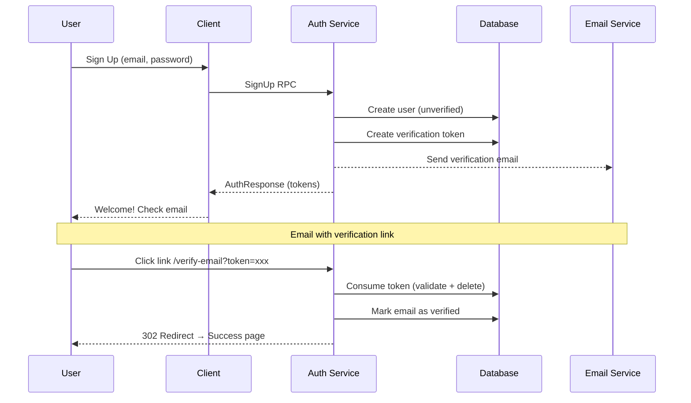

# Auth Service

High-performance authentication gRPC service built with Rust 1.92, Tonic, and SQLx.

## Architecture

```
┌───────────────────────────────────────────────────────────────────┐
│                    gRPC / gRPC-Web / REST                         │
├───────────────────────────────────────────────────────────────────┤
│  Middleware: Auth (JWT) │ Request ID │ Client IP │ Rate Limit     │
├───────────────────────────────────────────────────────────────────┤
│                       AuthService (Tonic)                         │
├───────┬──────────┬──────────┬─────────┬────────────┬──────────────┤
│auth-db│auth-proto│auth-email│auth-core│auth-storage│auth-telemetry│
│(SQLx) │ (Tonic)  │  (SMTP)  │(Shared) │    (S3)    │              │
├───────┴──────────┴──────────┴─────────┴────────────┴──────────────┤
│                  PostgreSQL │ S3-compatible                       │
└───────────────────────────────────────────────────────────────────┘
```

### Workspace Crates

| Crate            | Purpose                                                                |
| ---------------- | ---------------------------------------------------------------------- |
| `auth-core`      | Shared types, errors (`AppError`), traits (`StatusExt`, `ValidateExt`) |
| `auth-db`        | SQLx queries with compile-time verification                            |
| `auth-proto`     | Generated protobuf code from Tonic                                     |
| `auth-email`     | SMTP email delivery                                                    |
| `auth-mailjet`   | Mailjet API integration                                                |
| `auth-storage`   | S3-compatible object storage                                           |
| `auth-telemetry` | Tracing, metrics, OpenTelemetry                                        |

## Features

- **OWASP-compliant** authentication with account lockout and generic error messages
- **Multi-factor authentication** (TOTP, SMS, Email, Recovery codes)
- **OAuth 2.0** with PKCE (Google, GitHub, Microsoft, Apple, Facebook)
- **Session management** with device tracking and geolocation
- **JWT tokens** with configurable TTL (access + refresh)
- **Streaming RPCs** for efficient bulk data transfer
- **gRPC-Web** support for browser clients
- **OpenTelemetry** tracing and Sentry error tracking

## Quick Start

```bash
# 1. Configure environment
cp configs/.env.example configs/development.env

# 2. Run database migrations
make db

# 3. Start the service
make run
```

## Environment Variables

### Required

| Variable         | Description                                |
| ---------------- | ------------------------------------------ |
| `DB_URL`         | PostgreSQL URL: `postgres://user:@host/db` |
| `JWT_SECRET_KEY` | JWT signing key (min 32 chars)             |

### Server

| Variable              | Default         | Description                              |
| --------------------- | --------------- | ---------------------------------------- |
| `PORT`                | —               | Overrides `GRPC_ADDRESS` (optional)      |
| `REST_ADDRESS`        | —               | Not used, for future port separation     |
| `GRPC_ADDRESS`        | `0.0.0.0:50051` | Server bind address                      |
| `GRPC_WEB`            | `true`          | Enable gRPC-Web (HTTP/1.1)               |
| `GRPC_API_REFLECTION` | `false`         | Enable gRPC reflection                   |
| `CORS_ALLOW_ORIGINS`  | —               | Allowed origins (comma-separated or `*`) |
| `CONCURRENCY_LIMIT`   | `100`           | Max concurrent requests                  |

### Authentication

| Variable                       | Default | Description                |
| ------------------------------ | ------- | -------------------------- |
| `ACCESS_TOKEN_TTL_MINUTES`     | `60`    | Access token lifetime      |
| `REFRESH_TOKEN_TTL_DAYS`       | `90`    | Refresh token lifetime     |
| `PASSWORD_RESET_TTL_MINUTES`   | `60`    | Password reset link expiry |
| `EMAIL_VERIFICATION_TTL_HOURS` | `24`    | Email verification expiry  |

### Database

| Variable             | Default | Description                       |
| -------------------- | ------- | --------------------------------- |
| `DB_PASSWORD`        | —       | Password (inserted into `DB_URL`) |
| `DB_POOL_MIN`        | `2`     | Min pool connections              |
| `DB_POOL_MAX`        | `10`    | Max pool connections              |
| `DB_CONNECT_TIMEOUT` | `30`    | Connection timeout (seconds)      |

### Storage (S3)

| Variable               | Description                    |
| ---------------------- | ------------------------------ |
| `S3_URL`               | S3 endpoint URL                |
| `S3_ACCESS_KEY_ID`     | Access key ID                  |
| `S3_SECRET_ACCESS_KEY` | Secret access key              |
| `MAX_PHOTO_BYTES`      | Max upload size (default: 2MB) |

### Email (SMTP or Mailjet)

| Variable             | Description                        |
| -------------------- | ---------------------------------- |
| `EMAIL_PROVIDER`     | `smtp` or `mailjet`                |
| `EMAIL_SENDER`       | Sender: `Name <email@example.com>` |
| `DOMAIN`             | Application domain for email links |
| `SMTP_URL`           | SMTP URL: `smtp://user@host:port`  |
| `SMTP_PASSWORD`      | SMTP password                      |
| `MAILJET_API_KEY`    | Mailjet public key                 |
| `MAILJET_API_SECRET` | Mailjet private key                |

### Observability

| Variable        | Default | Description                            |
| --------------- | ------- | -------------------------------------- |
| `LOG_LEVEL`     | `INFO`  | TRACE, DEBUG, INFO, WARN, ERROR        |
| `JSON_LOGS`     | `true`  | JSON log format                        |
| `OTLP_ENDPOINT` | —       | OpenTelemetry collector endpoint       |
| `SENTRY_DSN`    | —       | Sentry error tracking DSN              |
| `ENVIRONMENT`   | —       | Environment name (production, staging) |

### Secrets from Files

All secrets support `*_FILE` variants for Docker/Kubernetes secrets:
- `JWT_SECRET_KEY_FILE`, `DB_PASSWORD_FILE`, `S3_SECRET_ACCESS_KEY_FILE`
- `SMTP_PASSWORD_FILE`, `MAILJET_API_SECRET_FILE`

## Authentication Flows

### Email Verification



### Password Recovery


### Password Change (Authenticated)


## API Overview

### Authentication
- `Authenticate` — Login with email/phone + password
- `SignUp` — Register new account
- `VerifyMfa` — Complete MFA challenge
- `RefreshTokens` — Refresh access token
- `SignOut` — End session

### OAuth 2.0
- `GetOAuthUrl` — Get authorization URL with PKCE
- `ExchangeOAuthCode` — Exchange code for tokens
- `LinkOAuthProvider` / `UnlinkOAuthProvider` — Manage linked accounts

### Password & Recovery
- `ChangePassword` — Change password (requires current)
- `RecoveryStart` / `RecoveryConfirm` — Password reset flow

### MFA Management
- `GetMfaStatus` / `SetupMfa` / `ConfirmMfaSetup` / `DisableMfa`

### Sessions
- `ListSessions` / `RevokeSession` / `RevokeOtherSessions`

### User Management (Admin)
- `ListUsersInfo` / `ListUsers` / `CreateUser` / `UpdateUser`

## Development

```bash
make watch      # Auto-rebuild on changes
make test       # Run tests
make fmt lint   # Format and lint
make pre-commit # All checks before commit
```

### Testing with grpcurl

```bash
# List services
grpcurl -plaintext localhost:50051 list

# Authenticate
grpcurl -plaintext localhost:50051 auth.AuthService/Authenticate \
  -d '{"identifier":"user@example.com","password":"..."}'
```

## Docker

```bash
make docker      # Build image
make docker-run  # Run container
```

## License

See [LICENSE](LICENSE) file.
